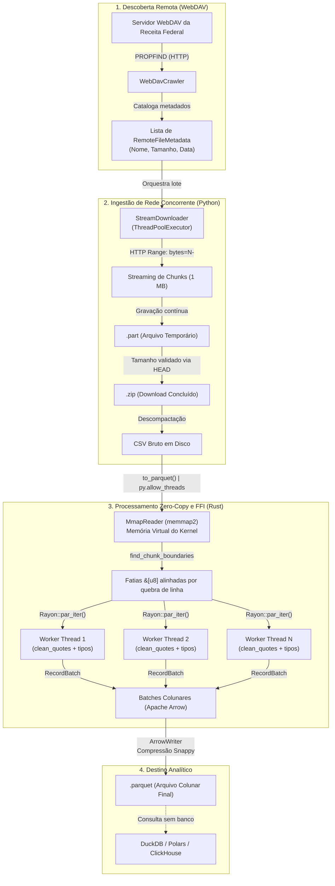
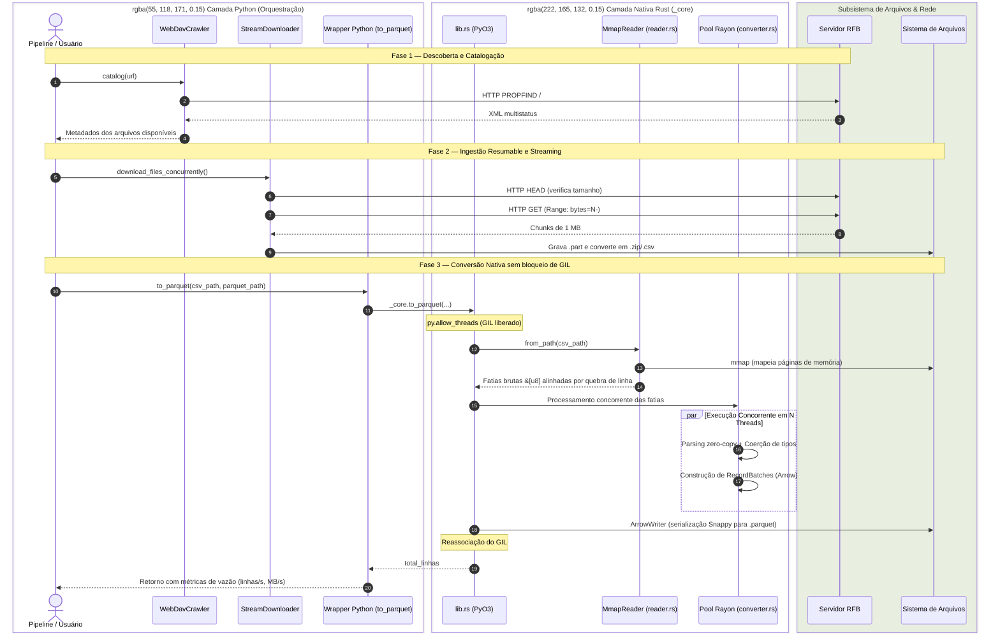

# Fluxo de Dados Ponta a Ponta

Este documento descreve o ciclo de vida dos dados no **CNPydge**, desde a consulta ao repositório público da Receita Federal até a persistência em formato analítico colunar.

## 1. Topologia de Dados e Gestão de Memória

O diagrama a seguir detalha a jornada dos bytes através dos subsistemas do CNPydge, destacando as fronteiras de memória virtual, isolamento de heap e processamento paralelo:

---

## 2. Diagrama de Sequência e Fronteiras FFI

O fluxo temporal demonstra as chamadas de método, a liberação explícita da GIL (*Global Interpreter Lock*) e a coordenação entre a orquestração Python e a extensão nativa:

---

## 3. Estágios Detalhados do Processamento

### Estágio 1: Descoberta e Catalogação
- Envio de requisição HTTP `PROPFIND` com profundidade 1.
- Extração de metadados (`displayname`, `getcontentlength`, `getlastmodified`) tolerante a variações de namespaces XML (`d:`, `oc:`, `nc:`).
- Mapeamento de prefixos nominais para os tipos de tabelas canônicas suportadas (`empresas`, `socios`, `estabelecimentos`, `simples`, etc.).

### Estágio 2: Download em Streaming e Resume
- Verificação se o arquivo local já existe com tamanho idêntico.
- Caso exista um arquivo `.part` parcial, envia cabeçalho `Range: bytes=<tam>-` para evitar re-download de dados já trafegados.
- Escrita atômica em blocos de 1 MB; ao finalizar com sucesso, renomeia `.part` para o nome definitivo (`.zip`).

### Estágio 3: FFI e Liberação de GIL
- `cnpydge.to_parquet(...)` valida caminhos e existência do arquivo fonte no Python.
- Chamada do binding Rust que executa `py.allow_threads(...)`, liberando a thread do Python para o loop de eventos ou outras tarefas.

### Estágio 4: Mapeamento de Memória Virtual (`mmap`)
- O arquivo é mapeado em memória virtual sem cópia intermediária de buffer via `memmap2`.
- As quebras de linha `\n` são identificadas de forma distribuída para calcular fatias contíguas (`&[u8]`) independentes.

### Estágio 5: Parsing Paralelo Zero-Copy
- Rayon distribui os blocos de bytes entre os núcleos da CPU.
- Parsers limpam aspas (`clean_quotes`), validam formato alfanumérico e convertem números/datas sem alocações de strings desnecessárias.
- Cada thread produz um `RecordBatch` Arrow.

### Estágio 6: Serialização Colunar Apache Parquet
- Um `ArrowWriter` consolidado recebe os `RecordBatch` gerados.
- Os dados são comprimidos com algoritmo Snappy e gravados de forma contínua em disco.
- Retorno da contagem de linhas e cálculo de vazão em megabytes por segundo (`MB/s`) e linhas por segundo (`linhas/s`).
