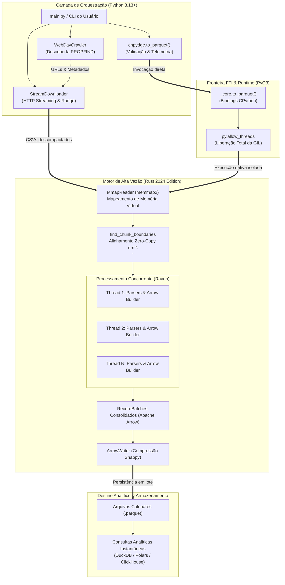

# Visão Geral da Arquitetura do CNPydge

O **CNPydge** é um pipeline híbrido de alta vazão concebido para ingestão, processamento e conversão analítica dos Dados Públicos de CNPJ da Receita Federal do Brasil (RFB).

## 1. Modelo em Camadas

O sistema adota uma separação rigorosa de responsabilidades:

## 2. Componentes Principais

### A. Camada de Orquestração (`orchestrator/cnpydge/`)
- **`crawler.py`:** Consulta o repositório WebDAV da Receita Federal via HTTP `PROPFIND`, cataloga arquivos disponíveis, extrai metadados (`Content-Length`, `Last-Modified`) e mapeia prefixos para tabelas canônicas.
- **`downloader.py`:** Executa downloads atômicos e concorrentes via `httpx.Client`, gerenciando arquivos parciais `.part` e implementando retentativas com cabeçalho `Range`.
- **`logging.py`:** Padroniza a telemetria com saída colorida no console e formatação RFC 3339.
- **`__init__.py`:** Expõe a API pública e executa pré-validações de integridade de arquivos e tipos de tabelas antes de invocar a extensão nativa.

### B. Fronteira FFI (`engine/src/lib.rs`)
- Compila a crate Rust como biblioteca dinâmica CPython (`_core`).
- Libera o GIL explicitamente via `py.allow_threads` durante a conversão de arquivos.
- Converte exceções internas em `PyRuntimeError`.

### C. Motor Nativo (`engine/src/`)
- **`reader.rs`:** Executa mapeamento de memória (`mmap`) e localiza limites de blocos alinhados a quebras de linha (`\n`) com custo zero de alocação.
- **Parsers (`empresa.rs`, `socio.rs`, `estabelecimento.rs`, `simples.rs`, `dominio.rs`):** Fatiam bytes brutos, validam formato alfanumérico e convertem campos para tipos estritos.
- **`converter.rs`:** Orquestra o particionamento com `Rayon`, instancia construtores Arrow (`StringBuilder`, `UInt32Builder`, etc.) e serializa os `RecordBatch` em Apache Parquet com compressão Snappy.

## 3. Invariantes Arquiteturais
1. **Sem bloqueio de GIL:** Toda operação de leitura, parsing e escrita que exceda 1ms deve ocorrer fora da GIL do Python.
2. **Memória de I/O Desacoplada da RAM:** O consumo de memória RAM na leitura não escala com o tamanho do arquivo fonte (garantido por `mmap` e streaming HTTP em blocos de 1 MB).
3. **Formatos Imutáveis e Fortemente Tipados:** Arquivos intermediários utilizam `.part` e a saída analítica final é exclusivamente Apache Parquet com esquema Arrow explícito.

